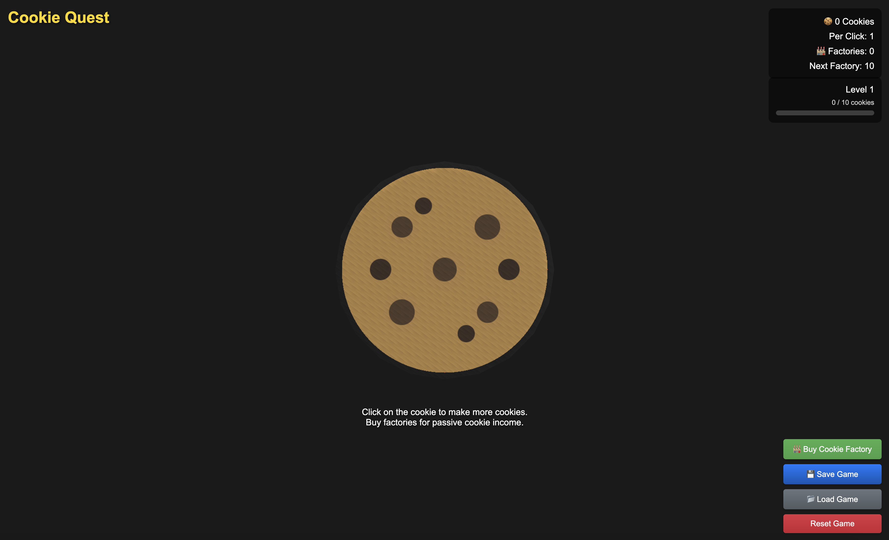

# cookie-quest
Cookie Quest HTML 5 Game


# Cookie Quest 🍪

Cookie Quest is a 3D Cookie Clicker clone built with JavaScript and PlayCanvas. Click cookies, build factories, and watch your cookie empire grow! This project was developed as an exploration of AI-assisted game development, specifically pair programming with Anthropic's Claude AI.



## Features

- 3D cookie with satisfying click animations and particle effects
- Automated cookie production through purchasable factories
- 20 levels of progression with increasing rewards
- Mobile-friendly touch controls
- Save system to persist your progress
- Responsive design that works across devices

## Live Demo
Try the game at [cookie-quest.technodabbler.com](https://cookie-quest.technodabbler.com)

## Getting Started

### Prerequisites

- Node.js (v18 or higher recommended)
- npm (comes with Node.js)

### Installation

1. Clone the repository
```bash
git clone git@github.com:adenau/cookie-quest.git
cd cookie-quest
```

2. Install dependencies
```bash
npm install
```

3. Start the development server
```bash
npm run dev
```

4. Open your browser and navigate to `http://localhost:5173`

### Building for Production

To create a production build:
```bash
npm run build
```

The built files will be in the `dist` directory.

## Embedding in Other Websites

Cookie Quest can be embedded in other websites using an iframe:

```html
<iframe 
    src="path/to/cookie-quest/dist/index.html" 
    style="width: 800px; height: 600px; border: none;"
    scrolling="no"
></iframe>
```

Or by directly including the built files:

```html
<div id="cookie-quest-container"></div>
<script type="module" src="path/to/cookie-quest/dist/assets/index-[hash].js"></script>
<link rel="stylesheet" href="path/to/cookie-quest/dist/assets/index-[hash].css">
```

## Development Background

Cookie Quest was developed as an experiment in AI-assisted game development, with most of the code written through pair programming with Claude AI. The project demonstrates how AI can assist in game development while still requiring human creativity, testing, and decision-making.

Inspired by the original [Cookie Clicker](https://en.wikipedia.org/wiki/Cookie_Clicker), this project explores modern web technologies and game development patterns while maintaining the addictive gameplay of its inspiration.

## Technical Stack

- [PlayCanvas](https://playcanvas.com/) - 3D rendering and game engine
- [Vite](https://vitejs.dev/) - Build tool and development server
- JavaScript (ES6+) - Core game logic
- CSS3 - Styling and animations

## Contributing

Contributions are welcome! Please feel free to submit a Pull Request.

## License

This project is licensed under the MIT License - see the [LICENSE](LICENSE) file for details.

## About the Author

**Alexandre Denault** is a veteran software developer, sysadmin, and holds a PhD in Computer Science. An avid computer enthusiast (geek) who has been dabbling with technology ever since his Dad brought home an 8086 computer.

- Blog: [TechnoDabbler](https://www.technodabbler.com/)
- LinkedIn: [Alexandre Denault](https://www.linkedin.com/in/alexandre-denault/)

## Acknowledgments

- Inspired by Orteil's [Cookie Clicker](https://orteil.dashnet.org/cookieclicker/)
- Developed with assistance from Anthropic's Claude AI
- Built with [PlayCanvas](https://playcanvas.com/)

---

Made with 🍪 and AI

An [ADInfo](https://www.adinfo.ca/) production